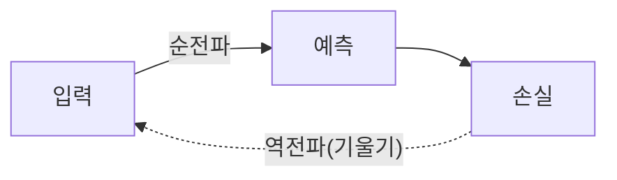

신경망 학습의 두 방향.

**순전파(Forward)**: 입력이 층을 거쳐 출력으로 흘러 예측을 만드는 과정. 학습 끝난 모델을 쓸 때(추론)도 이것만 돌린다.

**역전파(Backward)**: 예측이 틀린 정도([[손실 함수]])의 기울기를, 출력 쪽에서 입력 쪽으로 **거꾸로** 전달하며 각 가중치를 어떻게 고칠지 계산한다. 미적분의 연쇄법칙(chain rule)으로 층마다 기울기를 곱해 가며 전파한다.

이 "거꾸로 기울기 전달" 과정에서 작은 값이 계속 곱해지면 [[그래디언트 소실]]이 생긴다. 직접 손으로 미분하면 끔찍하지만, PyTorch의 [[Autograd]]가 역전파를 자동으로 해준다. 관련: [[경사하강법]].
