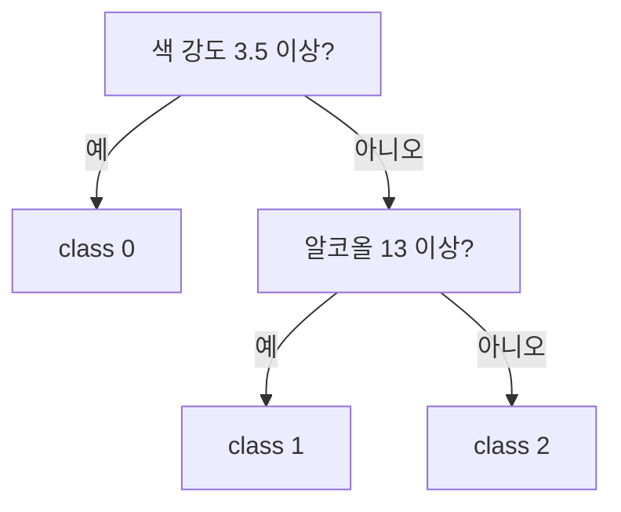

질문을 반복해 데이터를 나누는 모델 — 스무고개와 같다("동물인가?" → "다리 4개?" → "짖나?"). 특성 하나를 골라 "이 값보다 큰가?"로 두 갈래로 쪼개고, 나뉜 각 그룹을 또 쪼갠다.

장점은 **해석이 직관적**(질문을 따라가면 왜 그렇게 분류했는지 보임)이고, 선형 모델과 인터페이스가 같다(sklearn `fit/predict` — [[상속과 다형성]]의 다형성). "좋은 질문"을 고르는 기준은 [[지니 불순도]]. 끝까지 쪼개면 과적합하니 [[가지치기]]로 막고, 여럿을 모으면 강해진다([[앙상블]]).
