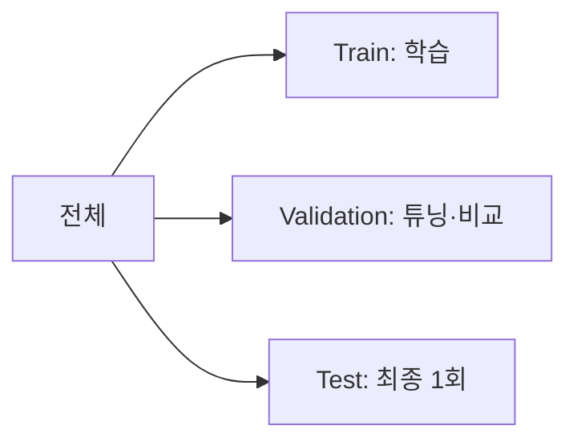

데이터를 **Train / Validation / Test** 세 덩어리로 나눈다(보통 6:2:2).

- **Train** — 모델 학습용
- **Validation** — [[하이퍼파라미터]]를 고르고 모델을 비교하는 용
- **Test** — 최종 성능 측정용, **딱 한 번만** 본다

왜 셋인가? 순진하게 "여러 설정으로 학습 → Test에서 제일 좋은 걸 선택"하면, Test를 여러 번 들여다보며 거기에 맞춰버려(누수) 평가가 거짓이 된다. Test는 "한 번도 안 본 데이터"여야 진짜 일반화 성능이다.

분류에선 `stratify=y`로 클래스 비율을 유지하며 나눈다. 분할의 "운"을 줄이려면 [[교차 검증]]을 쓴다.
