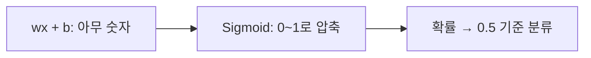

이름은 "회귀"지만 실제론 **분류**에 쓴다. "스팸인가 아닌가", "양성인가 악성인가" 같은 0/1 문제.

**왜 [[선형 회귀]]를 그대로 못 쓰나?** $wx+b$는 -5, 3.7, 100 등 아무 숫자나 나와 확률로 해석할 수 없다. 그래서 출력을 [[Sigmoid]]로 0~1로 짜부려 **확률**로 만들고, 0.5를 기준으로 분류한다.

손실은 [[Cross-Entropy]]. "확률을 회귀로 예측한 뒤 임계값으로 분류"라고 보면 이름이 납득된다. 이게 신경망 이진 분류(출력층 Sigmoid + Cross-Entropy)의 직접적 출발점이다.
